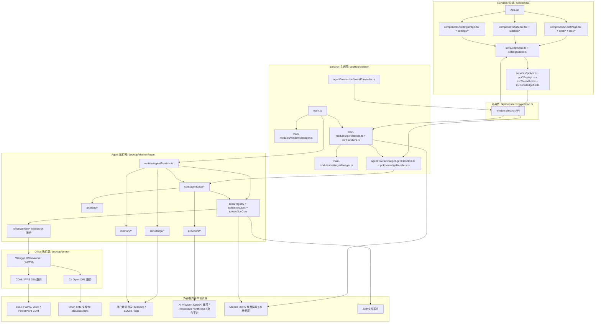
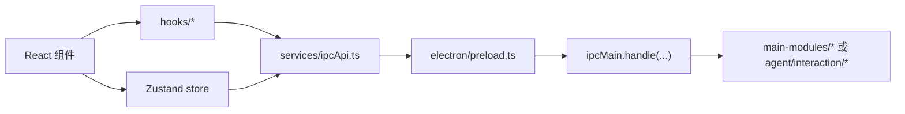
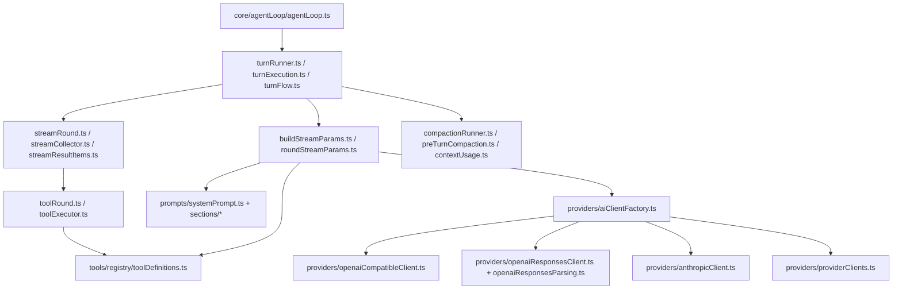
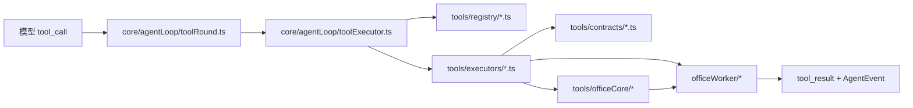
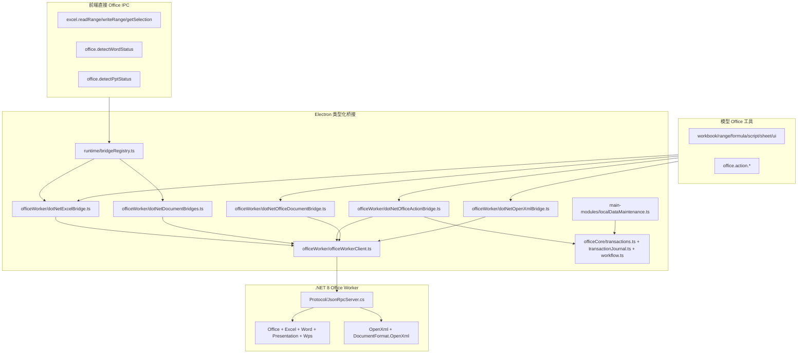
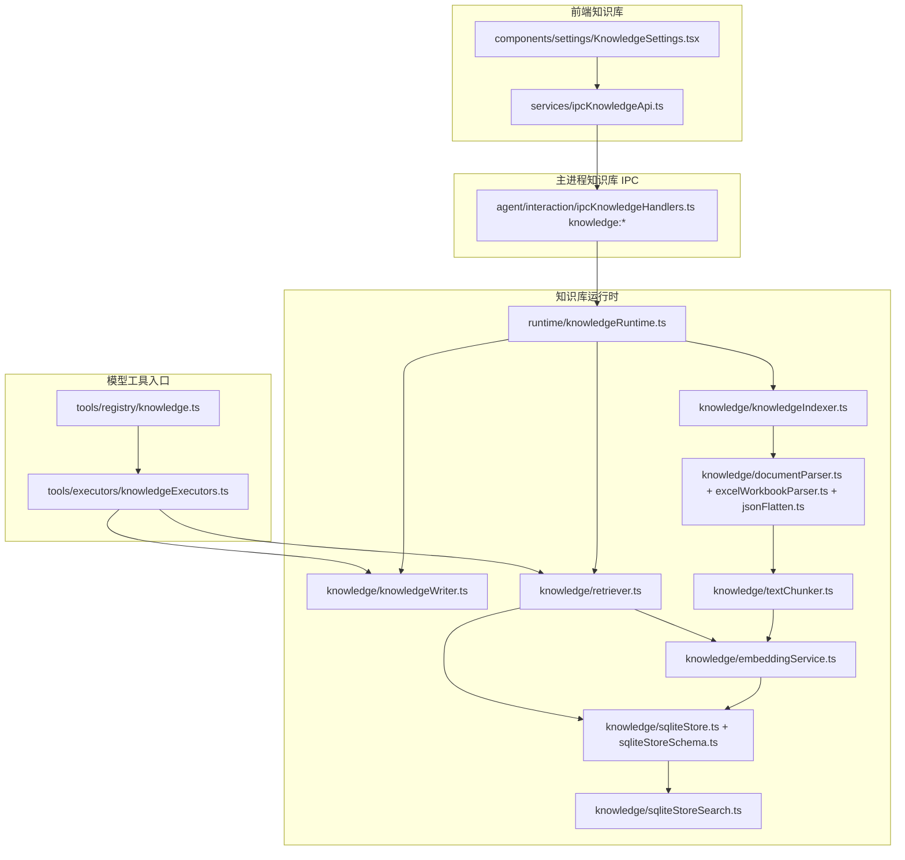
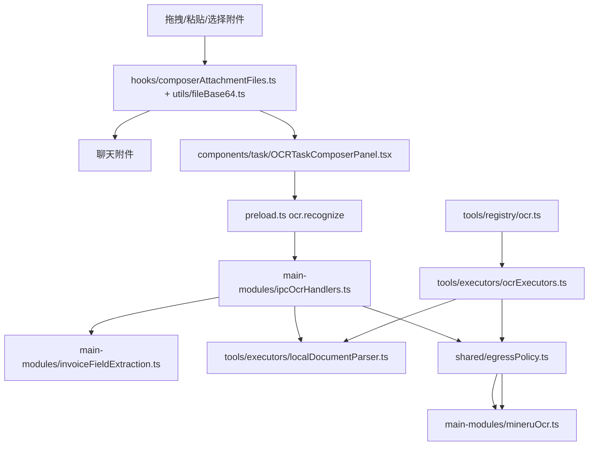
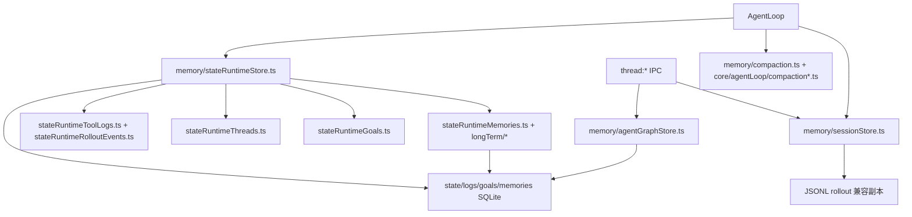
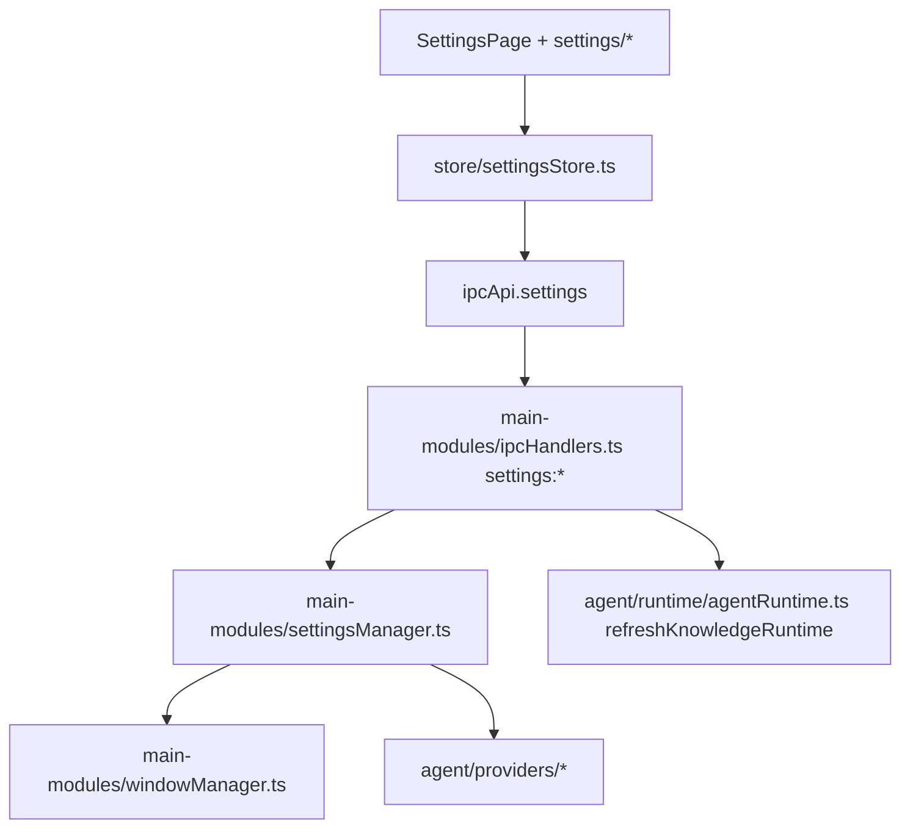

# 项目文件架构与调用链路图

更新时间：2026-07-15
范围：`desktop/` Electron 桌面端、Renderer 前端、Agent 运行时、Office/WPS 桥接、知识库、OCR、记忆、更新链路，以及 `product-site/` 发布服务。

## 1. 总体分层



核心边界：

- `desktop/src` 只通过 `services/ipcApi.ts` 访问主进程，避免组件直接散落调用 `window.electronAPI`。
- Renderer 首屏只同步加载应用壳、聊天主链路和侧栏；`SettingsPage`、Office 自动化及任务功能面板使用 `React.lazy` 按需加载。`npm run build` 会执行 `scripts/check-renderer-bundle-budget.cjs`，限制首屏入口为 480 KiB、任一 chunk 为 500 KiB，并要求至少两个异步 chunk。
- `desktop/electron/preload.ts` 是唯一暴露到 Renderer 的隔离桥。
- `main-modules/ipcHandlers.ts` 负责通用 IPC、Office 当前窗口 IPC及各域子 handler 汇总；`ipcSettingsHandlers.ts` 负责设置读写，`settingRuntimeEffects.ts` 负责设置落盘后的 Agent、知识库和窗口运行时同步。
- `agent/interaction/ipcAgentHandlers.ts` 负责 Agent、Thread、Stats 和工具审批相关 IPC；`ipcKnowledgeHandlers.ts` 独立负责知识库运行时初始化、路径授权、检索与索引 IPC。
- `agent/runtime/agentRuntime.ts` 负责把 AI 配置、Office bridge、知识库、记忆、工具执行器、AgentLoop 装配到一起。
- `agent/core/agentLoop/*` 只做对话轮次、模型流、工具调用、压缩、中断/恢复编排，不直接依赖 COM 具体实现。
- `agent/tools/registry` 是模型可见工具定义；`agent/tools/executors` 是工具路由；`agent/officeWorker` 是到 .NET 8 Worker 的类型化薄桥，COM、WPS JSA 与 C# Open XML 的实际实现位于 `desktop/dotnet/Wengge.OfficeWorker`。

## 2. 启动与运行时装配链路

```mermaid
sequenceDiagram
  participant Electron as electron/main.ts
  participant Settings as main-modules/settingsManager.ts
  participant Runtime as agent/runtime/agentRuntime.ts
  participant Bridges as runtime/bridgeRegistry.ts
  participant Knowledge as runtime/knowledgeRuntime.ts
  participant Tools as tools/executors/createToolExecutors.ts
  participant Loop as core/agentLoop/AgentLoop
  participant IPC as main-modules/ipcHandlers.ts
  participant Window as main-modules/windowManager.ts

  Electron->>Settings: getSessionStoreInstance()
  Electron->>Runtime: getOrCreateAgentRuntime(deps)
  Runtime->>Bridges: getOrCreateOfficeBridges()
  Runtime->>Knowledge: initializeKnowledgeRuntime(aiConfig, dataPath)
  Runtime->>Tools: createToolExecutors(bridges, retriever, memoryStore, deps)
  Runtime->>Loop: new AgentLoop(config)
  Runtime-->>Electron: AgentRuntime
  Electron->>IPC: registerIpcHandlers()
  IPC->>IPC: registerAgentIpcHandlers()
  IPC->>IPC: registerToolApprovalHandlers()
  Electron->>Window: createWindow()
```

启动关键文件：

| 文件 | 入口/职责 | 主要调用 | 主要产物 |
| --- | --- | --- | --- |
| `desktop/electron/main.ts` | Electron 生命周期入口 | `getOrCreateAgentRuntime`、`registerIpcHandlers`、`createWindow`、退出时 flush/close | 主窗口、Agent runtime、IPC 注册 |
| `desktop/electron/main-modules/settingsManager.ts` | electron-store、数据目录、Session/StateRuntime 生命周期 | `getActiveAIConfig`、`getSessionStoreInstance`、`getStateRuntimeStoreInstance` | 设置、数据路径、SQLite/JSONL 存储实例 |
| `desktop/electron/main-modules/dataPathMigration.ts` | 数据目录完整 staging、逐文件校验、空目标原子切换和回滚清理 | `settingsManager.migrateDataPath` | 设置/会话/知识/日志/Office 自动化完整副本 |
| `desktop/electron/main-modules/userDataExport*.ts` | 隐私导出 staging、凭据排除、会话/SQLite 静默点和运行时恢复 | `settingsManager.exportUserData` | 带类别清单的本地数据导出目录 |
| `desktop/electron/main-modules/userDataErase*.ts` | 精确确认、固定目录白名单、运行时静默点、部分失败报告和恢复 | `settingsManager.eraseUserData` | 当前活动数据根内的应用受管数据擦除结果 |
| `desktop/electron/main-modules/dataMaintenance.ts` | 维护锁与活动操作计数，覆盖设置、临时文件、OCR/Provider 检查、Office 自动化和周期留存 | IPC 子 handler、`localDataMaintenance.ts` | 迁移、导出、擦除与相关异步操作不重叠 |
| `desktop/electron/main-modules/windowManager.ts` | BrowserWindow、托盘、普通/紧凑模式、透明度/主题 | Electron `BrowserWindow`、设置值 | 主窗口状态、托盘行为 |
| `desktop/electron/main-modules/ipcHandlers.ts` | 通用 IPC 注册入口 | `registerAgentIpcHandlers`、Office bridge refs、settings/file/ocr/office automation 子 handler | 所有主进程 IPC handler |
| `desktop/electron/agent/runtime/agentRuntime.ts` | Agent 依赖装配 | `bridgeRegistry`、`knowledgeRuntime`、`createToolExecutors`、`AgentLoop` | `AgentRuntime`、`AgentLoopManager` |
| `desktop/electron/agent/runtime/bridgeRegistry.ts` | Office/WPS bridge 单例 | Excel/Word/PPT、宏和 .NET Open XML 薄桥构造 | `OfficeBridgeRegistry` |
| `desktop/electron/agent/runtime/knowledgeRuntime.ts` | RAG runtime 初始化/刷新 | `SqliteStore`、`EmbeddingService`、`KnowledgeIndexer`、`Retriever` | 知识库 store/indexer/retriever |

## 3. Renderer 到主进程 IPC



前端连接表：

| 功能模块 | 前端入口 | 状态/服务 | preload 暴露 | 主进程 handler |
| --- | --- | --- | --- | --- |
| 聊天对话 | `components/ChatPage.tsx`、`components/chat/*`、`components/task/*` | `store/chatStore.ts`、`store/chatTurnActions.ts`、`store/chatStreamBuffer.ts` | `electronAPI.agent.*` | `agent/interaction/ipcAgentHandlers.ts` |
| 会话/文件夹 | `components/Sidebar.tsx`、`components/sidebar/*` | `store/threadActions.ts`、`hooks/useSidebar*` | `electronAPI.thread.*`、`threadGraph.*`、`folder.*` | `ipcAgentHandlers.ts`、`ipcFileHandlers.ts` |
| 设置 | `components/SettingsPage.tsx`、`components/settings/*` | `store/settingsStore.ts`、`settingsPersistence.ts`、`settingsProviderState.ts` | `electronAPI.settings.*` | `main-modules/ipcSettingsHandlers.ts`、`settingRuntimeEffects.ts` |
| Excel 当前窗口 | `components/excel/HostSelectionDialog.tsx`、任务面板 | `hooks/useExcelConnection.ts`、`services/ipcOfficeApi.ts` | `electronAPI.excel.*` | `main-modules/ipcHandlers.ts` |
| Word/PPT 当前窗口 | `components/office/OfficePreviewPanel.tsx` | `hooks/useOfficeConnection.ts` | `electronAPI.office.*` | `main-modules/ipcHandlers.ts` |
| OCR 面板 | `components/task/OCRTaskComposerPanel.tsx` + OCR 子组件 | `utils/fileBase64.ts`、`ocrTaskFileHelpers.ts` | `electronAPI.ocr.recognize` | `main-modules/ipcOcrHandlers.ts`、`mineruOcr.ts` |
| 知识库设置页 | `components/settings/KnowledgeSettings.tsx` | `services/ipcKnowledgeApi.ts` | `electronAPI.knowledge.*` | `agent/interaction/ipcKnowledgeHandlers.ts` |
| 使用统计 | `components/settings/UsageStats.tsx` | `usageStatsData.ts` | `electronAPI.stats.getSummary` | `agent/interaction/ipcAgentHandlers.ts` |

## 4. 用户发消息与流式回显链路

```mermaid
sequenceDiagram
  participant User as 用户
  participant Composer as ComposerArea/useComposer
  participant ChatStore as store/chatStore.ts
  participant IpcApi as services/ipcApi.ts
  participant Preload as electron/preload.ts
  participant AgentIPC as agent/interaction/ipcAgentHandlers.ts
  participant Loop as core/agentLoop/*
  participant Provider as providers/*
  participant Forwarder as eventForwarder.ts
  participant UIStore as chatStreamBuffer + agentEventHandler
  participant View as ChatMessageList/AssistantGroupBlock

  User->>Composer: 输入文本/拖拽附件/选择功能模块
  Composer->>ChatStore: sendMessage / enqueueTurn
  ChatStore->>IpcApi: agent.startTurn(input)
  IpcApi->>Preload: window.electronAPI.agent.startTurn
  Preload->>AgentIPC: ipcRenderer.invoke("agent:startTurn")
  AgentIPC->>Loop: runAgentLoop / enqueue / continue
  Loop->>Provider: stream(params)
  Provider-->>Loop: reasoning/content/tool_call 增量
  Loop-->>Forwarder: onStreamDelta / onEvent
  Forwarder-->>Preload: webContents.send("agent:event")
  Preload-->>UIStore: agent.onEvent / onStreamDelta listener
  UIStore->>ChatStore: merge patches
  ChatStore->>View: 消息、思考、工具详情、最终回答渲染
```

关键文件连接：

| 阶段 | 文件 | 被谁调用 | 调用谁 |
| --- | --- | --- | --- |
| 输入组织 | `src/hooks/useComposer.ts`、`src/hooks/composerAttachmentFiles.ts` | `ComposerArea.tsx` | `ipcApi.file.*`、附件 base64/临时文件工具 |
| 功能模块提示词组装 | `src/utils/taskComposerPayloads.ts`、`components/task/*` | `ChatPage.tsx`、`FloatingTaskPanel.tsx` | `chatStore.sendMessage` |
| Turn 启动 | `src/store/chatTurnActions.ts` | `chatStore.ts` | `ipcApi.agent.startTurn` / `continueTurn` / `enqueueTurn` |
| IPC 请求 | `src/services/ipcApi.ts` | Store/Hooks/Components | `window.electronAPI.agent.*` |
| IPC 注册 | `electron/agent/interaction/ipcAgentHandlers.ts` | `main-modules/ipcHandlers.ts` | `AgentLoopManager.getLoopForThread`、SessionStore |
| Agent 编排 | `electron/agent/core/agentLoop/turnRunner.ts`、`turnExecution.ts`、`streamRound.ts`、`toolRound.ts` | `AgentLoop` | Provider、ToolExecutor、Memory/Session |
| 模型请求 | `electron/agent/core/agentLoop/buildStreamParams.ts`、`roundStreamParams.ts` | AgentLoop round | system prompt、history、tool definitions、knowledge/date/memory context |
| 事件转发 | `electron/agent/interaction/eventForwarder.ts` | AgentLoop callbacks | `BrowserWindow.webContents.send("agent:event", ...)` |
| 前端投影 | `src/store/chatStreamBuffer.ts`、`agentEventHandler.ts` | `chatStore.ts` | Zustand state patches |
| UI 渲染 | `components/chat/ChatMessageList.tsx`、`AssistantGroupBlock.tsx`、`ReasoningBubble.tsx`、`ToolCallBubble.tsx` | `ChatPage.tsx` | Markdown/StreamingOutput/ToolConfirmDialog |

## 5. Agent 核心与模型 Provider



Agent 核心文件：

| 文件/目录 | 职责 | 上游 | 下游 |
| --- | --- | --- | --- |
| `core/agentLoop/agentLoop.ts` | AgentLoop 门面，承接 start/continue/enqueue/interrupt | `ipcAgentHandlers.ts`、`AgentLoopManager` | `turnRunner.ts`、thread/session helpers |
| `core/agentLoop/turnRunner.ts` | 单轮 turn 编排 | `AgentLoop` | `turnExecution.ts`、`streamRound.ts`、`toolRound.ts` |
| `core/agentLoop/buildStreamParams.ts` | 组装系统提示词、上下文、工具定义、history | `roundStreamParams.ts` | `prompts/*`、`messageBuilder.ts` |
| `core/agentLoop/streamRound.ts` | 调模型流，收集增量 | `turnRunner.ts` | `providers/*`、`streamCollector.ts` |
| `core/agentLoop/toolRound.ts` | 处理模型工具调用 | `streamRound.ts` | `toolExecutor.ts` |
| `core/agentLoop/toolExecutor.ts` | 风险审批、工具执行日志、结果封装 | `toolRound.ts` | `tools/executors/*` |
| `core/agentLoop/compaction*.ts` | 上下文压缩、token 估算、历史裁剪 | `turnRunner.ts` | `memory/compaction.ts`、Provider |
| `providers/aiClientFactory.ts` | 按配置创建模型客户端 | `buildStreamParams.ts` / runtime | Responses/OpenAI Compatible/Anthropic/厂商子类 |
| `prompts/systemPrompt.ts` | 基础系统提示词 + 动态场景片段入口 | `buildStreamParams.ts` | `prompts/templates/*`、`promptComposer.ts` |

## 6. 工具注册、路由与执行链路



工具层连接表：

| 工具域 | 模型可见定义 | 执行器 | 实现/依赖 | 典型能力 |
| --- | --- | --- | --- | --- |
| Workbook/Range/Formula/Sheet | `tools/registry/workbook.ts`、`range.ts`、`formula.ts`、`sheet.ts` | `tools/executors/excelExecutors.ts` | `officeWorker/dotNetExcelBridge.ts`、.NET Worker | 检查工作簿、读写选区、公式验证、工作表操作、宿主选择 |
| Excel UI 控件 | `tools/registry/ui.ts` | `tools/executors/excelUiExecutors.ts`（由 `excelExecutors.ts` 组合） | `officeWorker/dotNetExcelBridge.ts`、.NET Worker | 工作表控件、表单和菜单 |
| 工作簿内部宏 | `tools/registry/macro.ts` | `tools/executors/excelMacroExecutors.ts`（由 `excelExecutors.ts` 组合） | `officeWorker/dotNetMacroBridges.ts`、.NET Worker | 仅在工作簿宿主内部运行 VBA/WPS JSA，不提供外部脚本执行 |
| File | `tools/registry/file.ts` | `fileExecutors.ts` | 本地 FS、路径授权 | 读写项目/附件文件 |
| Knowledge | `tools/registry/knowledge.ts` | `knowledgeExecutors.ts` | `knowledge/retriever.ts`、`knowledgeWriter.ts` | 检索、列出、写入、修改、追加、删除知识库内容 |
| Web | `tools/registry/web.ts` | `webSearchExecutors.ts` | `webSearchProviders.ts` 负责搜索源、超时与响应上限，`webSearchHtmlParsers.ts` 负责 HTML 解析 | 模型上网搜索 |
| OCR | `tools/registry/ocr.ts` | `ocrExecutors.ts` | MinerU token、免费降级、本地解析 | 图片/PDF OCR、发票字段提取辅助 |
| Memory | `tools/registry/memory.ts` | `memoryExecutors.ts` | `memory/longTerm/*` | 长期记忆列出、写入、删除 |
| Office 文件级 | `tools/registry/office.ts`、`officeReliability.ts` | `officeExecutors.ts`、`officeReliabilityExecutors.ts` | `officeCore/*`、`officeWorker/*`、`desktop/dotnet/Wengge.OfficeWorker/*` | 高级对象操作、链接报告、多窗口对象选择、持久化工作流和组事务恢复 |

`tools/registry/toolSchema.ts` 规范化所有模型可见参数 Schema：已声明对象默认拒绝未知字段，同一份 Schema 既发送给模型，也在工具审批前和 executor 调用前执行；运行时支持 `const/oneOf/allOf` 判别校验。Power Query、透视表、切片器及工作流步骤已按 operation 收紧参数；尚未细化的普通 operation 参数包继续受统一资源预算和业务策略校验。

## 7. Office/WPS 当前窗口与 OpenXML 文件级编辑



Office 连接详情：

| 场景 | 入口文件 | 调用链 | 输出 |
| --- | --- | --- | --- |
| 读取/写入当前 Excel/WPS | `preload.ts` 的 `excel.*`、`ipcOfficeApi.ts`、`ipcHandlers.ts` | `runtime/bridgeRegistry.ts` -> `officeWorker/dotNetExcelBridge.ts` -> .NET Worker | 单元格值、选区、工作簿结构、写入结果 |
| 公式生成/验证 | `tools/registry/formula.ts`、`prompts/templates/scenarios/formula.zh-CN.md` | `excelExecutors.ts` -> `dotNetExcelBridge.ts` -> .NET Worker | 公式写入、回读、动态数组 spill 校验 |
| Word/PPT 当前窗口状态 | `preload.ts` 的 `office.*` | `ipcHandlers.ts` -> `runtime/bridgeRegistry.ts` -> `dotNetDocumentBridges.ts` | 当前宿主连接状态 |
| 文件级 Word/PPT/Excel 编辑 | `tools/registry/office.ts` | `officeExecutors.ts` -> `officeCore/officeActionTransactionAdapter.ts` -> `officeActionAdapter.ts` -> `dotNetOfficeActionBridge.ts` -> .NET Worker | 修改后的 Office 文件、视觉快照、变更摘要 |
| 高级对象与跨应用操作 | `office.action.*`、`office.workflow.*`、`office.transaction.*` | `officeActionTransactionAdapter.ts` 负责单动作备份和独立跨 Office 事务；`officeActionAdapter.ts` 负责 Open XML/COM 能力路由；`officeActionValidation.ts` 解释验证结果；`officeReliabilityExecutors.ts` -> `workflow.ts` / `transactionJournal.ts` | Excel 查询/打印/公式治理、Word/PPT 高级编辑、链接报告原位刷新、步骤产物、暂停续跑、整体撤销和重做 |
| 多窗口与对象选择 | `office.documents.*`、`office.objects.*` | `officeReliabilityExecutors.ts` -> `dotNetOfficeDocumentBridge.ts` -> .NET Worker | 打开文档列表、按完整路径定位，列出并激活工作表/区域/图表/页面/书签/幻灯片/形状 |
| Open XML 文件处理 | `office.action.*` | `dotNetOpenXmlBridge.ts` / `dotNetOfficeActionBridge.ts` -> .NET Worker 的 `OpenXml/*` | xlsx/docx/pptx 的结构化读取、编辑、校验和视觉快照 |

## 8. 知识库 RAG 与模型可修改内容链路



知识库文件连接：

| 文件 | 职责 | 上游 | 下游/数据 |
| --- | --- | --- | --- |
| `components/settings/KnowledgeSettings.tsx` | 展示已索引来源、索引文件/文件夹、删除/重建 | 设置页 | `ipcKnowledgeApi.ts` |
| `services/ipcKnowledgeApi.ts` | 前端知识库 IPC wrapper | KnowledgeSettings、其他前端 | `window.electronAPI.knowledge.*` |
| `agent/interaction/ipcKnowledgeHandlers.ts` | `knowledge:listSources/search/indexFile/indexFolder/deleteFile/reindexAll`；逐来源重新校验路径授权 | preload、`ipcAgentHandlers.ts` 组合注册 | `knowledgeRuntime`、path authorizer |
| `runtime/knowledgeRuntime.ts` | 创建/刷新 RAG runtime；provider/model 变化时重载 | Agent runtime、settings:set | `SqliteStore`、`EmbeddingService`、`KnowledgeIndexer`、`Retriever` |
| `knowledge/documentParser.ts` | 解析 txt/md/csv/json/docx/pptx/pdf 等文档文本 | `KnowledgeIndexer` | 纯文本段落 |
| `knowledge/excelWorkbookParser.ts` | Excel 工作簿解析为文本/表格语义 | `documentParser.ts` | sheet/table 文本 |
| `knowledge/textChunker.ts` | 按标题、表格、长度切块 | `KnowledgeIndexer` | chunk records |
| `knowledge/embeddingService.ts` | 根据当前 AI provider 生成 embedding | indexer/retriever | 向量与 profile |
| `knowledge/sqliteStore.ts` | 知识库 SQLite 连接生命周期、事务、CRUD、来源摘要和维护；保持检索公共入口并委托查询算法 | indexer/retriever/writer | `knowledge.sqlite`、`sqliteStoreSearch.ts` |
| `knowledge/sqliteStoreSearch.ts` | 构造向量/关键词查询过滤，隔离损坏向量，完成余弦排序和关键词去重 | `sqliteStore.ts` | 检索结果 |
| `knowledge/knowledgeWriter.ts` | 模型写入、替换、追加、删除知识库内文本来源 | `knowledgeExecutors.ts` | 可写文本来源和索引重建 |
| `tools/registry/knowledge.ts` | 模型可见知识库工具 schema | `toolDefinitions.ts` | `knowledge.search/listSources/write/updateSource/deleteSource` |
| `tools/executors/knowledgeExecutors.ts` | 工具参数校验、调用 retriever/writer | `toolExecutor.ts` | tool_result |

## 9. OCR、附件与视觉解析链路



OCR/附件连接：

| 场景 | 文件 | 调用关系 |
| --- | --- | --- |
| 聊天附件上传 | `hooks/useComposer.ts`、`composerAttachmentFiles.ts`、`utils/fileBase64.ts` | 解析拖拽/粘贴文件，生成附件对象，随 `AgentTurnInput.attachments` 进入 Agent |
| 图片预览 | `components/chat/AttachmentImagePreview.tsx`、`utils/attachmentPreview.ts` | 消息列表读取附件路径/base64 展示 |
| OCR 功能面板 | `components/task/OCRTaskComposerPanel.tsx`、`OCRFileUploadSection.tsx`、`OCRResultSection.tsx` | 前端静默识别并展示字段和预览，可写回 Excel |
| 主进程 OCR IPC | `main-modules/ipcOcrHandlers.ts`、`ipcOcrHandlers.test.ts` | `ocr:recognize` 入口，本地优先；统一远程数据开关允许后才进入 MinerU/模型字段抽取 |
| 数据外传策略 | `shared/egressPolicy.ts` | 默认本地模式，统一约束 OCR、搜索、Embedding 与发票模型抽取，发送前检查高置信凭据 |
| MinerU 接口 | `main-modules/mineruOcr.ts` | 只处理本地无法解析且已获远程数据授权的文件；标准 token 失败后可进入免费 Agent |
| 发票字段提取 | `main-modules/invoiceFieldExtraction.ts` | 将 OCR 文本整理为字段结构 |
| 模型 OCR 工具 | `tools/registry/ocr.ts`、`tools/executors/ocrExecutors.ts` | 让无多模态模型通过工具识别图片/PDF |
| 本地文档解析兜底 | `tools/executors/localDocumentParser.ts` | 解析 docx/pptx/pdf/txt/json 等本地内容 |

## 10. 会话、记忆、压缩与线程拓扑



记忆/会话文件连接：

| 文件 | 职责 | 连接 |
| --- | --- | --- |
| `memory/sessionStore.ts` | 会话、线程、turn、rollout 兼容写入 | AgentLoop 写入；thread IPC 读取；`sessionStoreFiles.ts` 扫描文件 |
| `memory/stateRuntimeStore.ts` | state/logs/goals/memories 四库门面 | AgentLoop、Stats、LongTermMemoryStore |
| `memory/stateRuntimeThreads.ts` | 线程快照与运行态 SQL | `StateRuntimeStore` |
| `memory/stateRuntimeToolLogs.ts` | 工具执行日志 | `toolExecutionLog.ts`、UsageStats |
| `memory/stateRuntimeRolloutEvents.ts` | rollout 事件和 FTS 搜索 | `StateRuntimeStore` |
| `memory/stateRuntimeGoals.ts` | 任务目标持久化 | `StateRuntimeStore` |
| `memory/stateRuntimeMemories.ts` | 长期记忆表级 CRUD | `LongTermMemoryStore` |
| `memory/longTerm/*` | 长期记忆抽取、合并、裁剪、成功画像 | `memoryExecutors.ts`、AgentLoop 启动任务 |
| `memory/agentGraphStore.ts` | 线程派生关系图 | `threadGraph:* IPC` |
| `memory/compaction.ts` | 历史压缩和 token 估算基础能力 | `core/agentLoop/compaction*.ts` |

## 11. 设置、Provider 与窗口体验



设置链路：

| 模块 | 文件 | 说明 |
| --- | --- | --- |
| 设置页面 | `components/SettingsPage.tsx`、`settings/*` | 模型、常规、知识库、软件更新、开源项目、统计页 |
| 设置状态 | `store/settingsStore.ts`、`settingsLoadedState.ts`、`settingsProviderState.ts`、`settingsValues.ts` | 从 electron-store 加载，局部持久化更新 |
| Provider UI | `AddProviderDialog.tsx`、`EditProviderDialog.tsx`、`ProviderCard.tsx`、`ReasoningModeSelect.tsx` | 模型配置、推理模式、聚合平台适配 |
| Provider 运行时 | `providers/aiClientFactory.ts`、`openaiCompatibleClient.ts`、`openaiResponsesClient.ts`、`providerClients.ts` | 生成统一 AI client，适配不同协议 |
| 常规体验 | `GeneralSettings.tsx`、`windowManager.ts` | 紧凑模式、透明度、动态数组函数环境支持 |
| 设置变更副作用 | `ipcSettingsHandlers.ts` 持久化并调用 `settingRuntimeEffects.ts` | AI 配置变化刷新 Agent/Knowledge runtime；权限、压缩、主题、透明度和动态数组开关同步到各自运行时 |

## 12. 文件级模块索引

| 顶层目录/文件 | 模块定位 | 主要上游 | 主要下游 |
| --- | --- | --- | --- |
| `desktop/src/main.tsx` | React 入口 | Vite/Electron renderer | `App.tsx` |
| `desktop/src/App.tsx` | 应用壳、页面切换、窗口按钮 | React root | ChatPage、Sidebar、SettingsPage、settingsStore |
| `desktop/src/components/chat/*` | 消息、思考、工具、Markdown、流式渲染 | ChatPage、chatStore | UI 展示、ToolConfirmDialog |
| `desktop/src/components/task/*` | 公式/代码/OCR/报告/简单任务面板 | FloatingTaskPanel | task payload、OCR IPC、chatStore |
| `desktop/src/components/settings/*` | 设置子页面和弹窗 | SettingsPage | settingsStore、ipcApi |
| `desktop/src/components/sidebar/*` | 会话/文件夹/搜索/排序/底部状态 | Sidebar | threadActions、folder/file IPC |
| `desktop/src/hooks/*` | 输入框、Office 连接、侧边栏交互 hooks | 组件 | ipcApi、utils |
| `desktop/src/services/*` | 前端 IPC wrapper 和 mock | stores/components/tests | preload 暴露的 electronAPI |
| `desktop/src/store/*` | Zustand 状态、事件投影、线程操作 | UI、preload event | ipcApi、agentEventHandler、chatStreamBuffer |
| `desktop/src/utils/*` | 纯函数和格式化工具 | UI/store/hooks | 无运行时副作用 |
| `desktop/electron/preload.ts` | 安全隔离桥 | Renderer | ipcRenderer.invoke/on |
| `desktop/electron/main.ts` | 主进程生命周期入口 | Electron app | runtime、IPC、window、shutdown |
| `desktop/electron/main-modules/*` | 主进程设置、窗口、文件、AI、OCR 与 Office IPC | main.ts/preload | settingsManager、Agent runtime、MinerU、本地 FS |
| `desktop/electron/agent/interaction/*` | Agent IPC 与事件转发 | main-modules/ipcHandlers.ts | AgentLoop、Session/Knowledge/Stats、BrowserWindow |
| `desktop/electron/agent/runtime/*` | Agent 装配层 | main.ts、settings:set | bridges、knowledge、memory、toolExecutors、AgentLoop |
| `desktop/electron/agent/core/agentLoop/*` | 对话轮次和工具编排核心 | ipcAgentHandlers、AgentLoopManager | providers、prompts、tools、memory |
| `desktop/electron/agent/providers/*` | AI 协议客户端 | AgentLoop | OpenAI/Responses/Anthropic/厂商 API |
| `desktop/electron/agent/prompts/*` | 系统提示词和场景片段 | buildStreamParams | 模型请求 |
| `desktop/electron/agent/tools/registry/*` | 工具 schema | buildStreamParams/toolExecutor | 模型可见工具列表 |
| `desktop/electron/agent/tools/executors/*` | 工具执行器 | toolExecutor | contracts、officeCore、officeWorker、knowledge、OCR |
| `desktop/electron/agent/tools/officeCore/*` | Office action 统一定位、能力、结果适配和事务工作流 | officeExecutors | .NET Worker 类型化桥接 |
| `desktop/electron/agent/officeWorker/*` | Electron 到 Office Worker 的 JSON-RPC 客户端和类型化薄桥 | runtime、executors、officeCore、IPC | 自包含 .NET Worker 子进程 |
| `desktop/dotnet/Wengge.OfficeWorker/*` | Excel/Word/PPT/WPS COM 与 Open XML 具体能力 | Electron officeWorker 客户端 | COM、DocumentFormat.OpenXml、STA 调度 |
| `desktop/electron/agent/knowledge/*` | RAG 文档解析、切块、embedding、检索、写入维护 | runtime、knowledge IPC、knowledge tools | SQLite、AI embedding |
| `desktop/electron/agent/memory/*` | 会话、运行态、长期记忆、压缩、线程图 | AgentLoop、thread IPC、memory tools | SQLite、JSONL |
| `desktop/electron/agent/shared/*` | Agent 共享类型、消息转换、数值限制 | core/providers/tools | 轻量公共能力 |

## 13. 维护注意事项

- 新增前端能力时，优先走 `services/ipcApi.ts` 子 wrapper；如果新增 preload API，需要同步 `src/electronApi.d.ts`、`services/ipcApiTypes.ts` 和对应 wrapper。
- 新增模型工具时，必须同时补齐 `tools/registry/*`、`tools/executors/*`、必要的 `contracts/*` 或 `officeWorker/*`，并确认 `toolDefinitions.ts` 暴露顺序。
- 新增 Office 文件级能力时，优先接 `office.action.*`；Electron 侧只扩展类型化 Worker 契约，具体 Open XML 或 COM 能力放在 `desktop/dotnet/Wengge.OfficeWorker`。
- 新增知识库解析格式时，入口应在 `knowledge/documentParser.ts` 或独立 parser，再接 `KnowledgeIndexer -> textChunker -> embeddingService -> sqliteStore`；模型可修改能力走 `KnowledgeWriter`。
- 修改 AI provider、reasoning、context 逻辑时，需要同步 `providers/*`、`settingsProviderState.ts`、`ReasoningModeSelect.tsx` 和 `buildStreamParams.ts`。
- 修改流式渲染时，要同时考虑主进程 `eventForwarder.ts` 的 32ms 合并和前端 `chatStreamBuffer.ts` 的 50ms 合并，避免工具事件、思考正文和最终回答时间线错位。
- 新增非首屏 Renderer 功能时优先保持动态 import 边界；不要通过调高 Vite 告警阈值绕过 bundle budget。`electron:build` 必须复用 `npm run build`，确保安装包与 CI 使用同一体积门禁。
