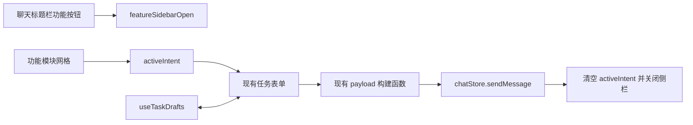

# 右侧功能模块侧栏迁移设计

## 背景

当前聊天页面同时存在三套右侧交互：

- `FeatureFloatingDock` 提供紫色悬浮球和六个功能模块入口。
- `FloatingTaskPanel` 以可拖拽浮窗承载功能模块表单。
- `OfficePreviewPanel` 作为右侧文件编辑监控栏，展示从工具结果提取的文件编辑事件。

这些入口分散、会遮挡聊天内容，文件监控侧栏的收缩过程也比较生硬。本次调整将功能入口和表单统一迁移到右侧侧栏，并彻底删除原文件编辑监控功能。

## 目标

1. 删除聊天区域中的紫色悬浮球。
2. 删除可拖拽、可折叠的任务浮窗。
3. 将六个功能模块及其完整表单迁移到右侧功能侧栏。
4. 删除原右侧文件编辑监控界面、事件提取和关联测试。
5. 让右侧功能侧栏平滑展开和收起。
6. 保留现有任务草稿、选区、OCR、提交和消息发送行为。

## 非目标

- 不修改六个功能模块的业务字段和提示词格式。
- 不修改 Agent 会话运行状态监听。
- 不修改 Excel、Word、PowerPoint 的连接检测。
- 不新增文件系统监听或 Office 编辑事件。
- 不调整左侧项目和会话侧边栏。

## 选定方案

采用单一右侧功能侧栏：

- 默认收起。
- 聊天标题栏右上角显示功能模块按钮。
- 点击按钮展开右侧栏。
- 侧栏顶部显示六个模块入口。
- 选择模块后在入口下方显示原有表单。
- 点击提交并进入消息发送链路后自动关闭侧栏。

未采用常驻图标轨道，因为它会持续占用水平空间，且纯图标入口不如文字模块清晰。未采用覆盖式抽屉，因为它会遮挡聊天内容。

## 界面结构

### 收起状态

聊天标题栏右上角显示带 `Sparkles` 图标的功能模块按钮。原文件监控 `Activity` 图标和相关文案全部移除。

### 展开状态

右侧栏宽度目标为 `360px`，结构如下：

1. 标题栏
   - 标题为“功能模块”。
   - 右侧提供关闭按钮。
2. 模块选择区
   - 使用两列三行网格。
   - 模块包含图标和中文名称。
   - 当前模块使用现有主色高亮。
3. 表单区
   - 占据剩余高度并允许纵向滚动。
   - 直接渲染现有任务表单。
   - 不再添加浮窗容器、拖拽把手或折叠按钮。
4. 未选择模块状态
   - 只显示模块选择区。
   - 表单区显示简短空状态，提示用户选择功能。

六个模块保持现有顺序：

1. 生成公式
2. 代码生成
3. OCR / 发票识别
4. 数据清洗
5. 报告生成
6. 图表分析

## 交互规则

### 打开和关闭

- 点击聊天标题栏功能按钮打开侧栏。
- 点击侧栏关闭按钮收起侧栏。
- 再次点击标题栏功能按钮可收起侧栏。
- 关闭侧栏会清空当前模块选择，但不清空任何模块草稿。
- 点击提交并进入消息发送链路后清空当前模块选择并自动收起侧栏。

### 模块切换

- 点击模块后更新 `activeIntent`。
- 模块选择区始终保留，用户可直接切换。
- `useTaskDrafts` 继续按会话草稿键保存各模块草稿。
- 切换模块不会丢弃其它模块已填写内容。

### 任务提交

沿用当前 `handleTaskSubmit` 链路：

1. 任务表单生成结构化 payload。
2. payload 写入输入框状态。
3. 调用 `sendMessage(payload)`。
4. 清空输入框可见值。
5. 清空当前模块选择。
6. 收起右侧栏。

普通聊天输入和功能模块提交继续共用消息发送链路。

## 组件设计

### 新增 `FeatureSidebarPanel`

文件路径：

`desktop/src/components/common/FeatureSidebarPanel.tsx`

职责：

- 渲染侧栏标题和关闭按钮。
- 渲染 `INTENT_SHORTCUTS` 模块网格。
- 根据 `activeIntent` 渲染传入的表单内容。
- 提供稳定的可访问性属性。

组件不负责：

- 管理任务草稿。
- 组装任务 payload。
- 发送消息。
- 读取 Office 状态。

### 调整 `ChatPage`

`ChatPage` 增加本地 `featureSidebarOpen` 状态，并负责：

- 标题栏功能按钮开关。
- 将 `activeIntent` 和模块点击回调传给侧栏。
- 在侧栏中渲染现有六种任务表单。
- 点击提交并进入消息发送链路后关闭侧栏。

`activeIntent` 迁移到 `ChatPage` 本地状态，因为删除悬浮入口后不再有其它组件需要持有该状态。`App` 删除对应状态和属性传递。

### 保留现有模块

以下模块保留业务实现，仅改变容器位置：

- `FormulaTaskComposerPanel`
- `CodeTaskComposerPanel`
- `OCRTaskComposerPanel`
- `ReportTaskComposerPanel`
- `SimpleTaskComposerPanel`
- `useTaskDrafts`
- `taskComposerPayloads`

## 删除范围

### 删除悬浮入口和任务浮窗

- `desktop/src/components/common/FeatureFloatingDock.tsx`
- `desktop/src/components/common/FeatureFloatingDock.test.ts`
- `desktop/src/components/common/featureFloatingDockGeometry.ts`
- `desktop/src/components/common/FloatingTaskPanel.tsx`
- `floating-task-panel.css` 中所有悬浮球和任务浮窗样式

如果 `floating-task-panel.css` 删除后不再有其它用途，则删除整个文件及 `global.css` 中的导入。

### 删除文件编辑监控

- `desktop/src/components/office/OfficePreviewPanel.tsx`
- `desktop/src/utils/officeEditEvents.ts`
- `desktop/src/utils/officeEditEvents.test.ts`
- `desktop/src/styles/office-preview-panel.css`
- `global.css` 中对应样式导入
- `ChatPage` 中的事件收集、监控开关状态和 `Activity` 图标

删除范围仅针对右侧文件编辑监控。`ThreadWatchManager` 属于 Agent 会话运行状态机制，与文件监控无关，必须保留。

## 样式与动画

新增独立样式文件：

`desktop/src/styles/feature-sidebar-panel.css`

### 尺寸

- 展开宽度：`360px`
- 最小宽度：`320px`
- 收起宽度和 `flex-basis`：`0`
- 面板高度：聊天工作区完整高度

### 展开动画

- 外层同时过渡 `width`、`flex-basis`、`opacity` 和边框颜色。
- 内容层从 `translateX(8px)`、`opacity: 0` 进入正常位置。
- 动画时长约 `200ms`。
- 使用缓出曲线，例如 `cubic-bezier(0.22, 1, 0.36, 1)`。

### 收起动画

- 外层保持内容尺寸直到动画开始，避免表单被持续挤压。
- 内容层先淡出并轻微右移。
- 外层随后收缩到 `0`。
- 收起时长可略短于展开，但整体不超过 `200ms`。

### 减少动态效果

在 `prefers-reduced-motion: reduce` 下关闭位移和过渡动画。

### 响应式

- 紧凑窗口模式下隐藏功能按钮和功能侧栏。
- 窗口宽度不足时不展开侧栏，防止主聊天区过度压缩。
- 使用原右侧栏的 `980px` 响应式阈值。

## 数据流



原文件编辑监控的数据流将被删除：

```text
messages -> collectOfficeEditEvents -> OfficePreviewPanel
```

## 错误处理

- 表单内部错误处理保持不变。
- 打开或关闭侧栏不触发 IPC。
- 发送失败时沿用聊天 store 的错误提示。
- `handleTaskSubmit` 调用发送后仍按现有行为关闭侧栏，不额外引入发送结果等待。
- 选区、OCR 和 Office 连接错误继续由原任务表单展示。

## 测试设计

### 单元测试

新增或调整测试覆盖：

1. 功能按钮可打开和关闭侧栏。
2. 六个模块入口全部显示。
3. 点击模块会切换 `activeIntent`。
4. 当前模块使用激活状态。
5. 关闭侧栏不清空草稿。
6. 点击提交并进入消息发送链路后关闭侧栏并清空模块选择。
7. 不再收集或渲染 Office 文件编辑事件。
8. 删除旧悬浮球几何和文件监控测试。

### 静态验证

- 搜索确认不存在 `FeatureFloatingDock`、`FloatingTaskPanel`、`OfficePreviewPanel`、`collectOfficeEditEvents` 和旧 CSS class。
- `npm run typecheck`
- `npm run lint`
- `npm test`
- `npm run build`

### 界面验证

使用 Playwright 或 Electron 界面截图验证：

- 正常宽度下的收起状态。
- 正常宽度下的模块网格。
- 各类长表单在侧栏内可滚动且无横向溢出。
- 展开和收起时聊天区域无明显跳变。
- 紧凑模式和窄窗口下无重叠。
- 浅色和深色主题均可读。

## 验收标准

1. 页面不再出现紫色悬浮球。
2. 页面不再出现可拖拽任务浮窗。
3. 原文件编辑监控入口、面板和数据提取全部删除。
4. 右上角功能按钮能平滑打开和关闭功能侧栏。
5. 六个功能模块全部可以使用原有完整表单。
6. 模块切换保留草稿。
7. 功能发送后侧栏自动收起。
8. 侧栏收缩时聊天区平滑回弹，表单不出现明显挤压变形。
9. 全量测试、类型检查、lint、构建和界面截图验证通过。
